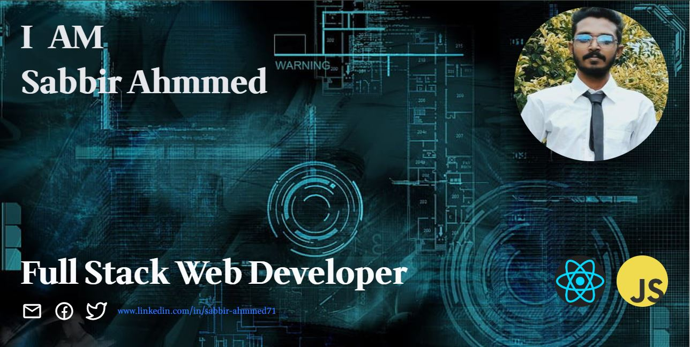

<h1>About Me</h1>

I am Sabbir Ahmmed a professional MERN stack web developer with extensive experience in building dynamic and responsive web applications. Proficient in HTML, CSS, Tailwind CSS, JavaScript, ReactJS, NodeJS, ExpressJS, and MongoDB, I will combines technical expertise with a passion for innovative solutions to deliver high-quality projects. Dedicated to continuous learning and staying updated with the latest industry trends, I will committed to providing exceptional value to clients and teams.

<h1>Current Stats</h1>

<h1>Technologies thai I know</h1>

 
      
   
</a>  

